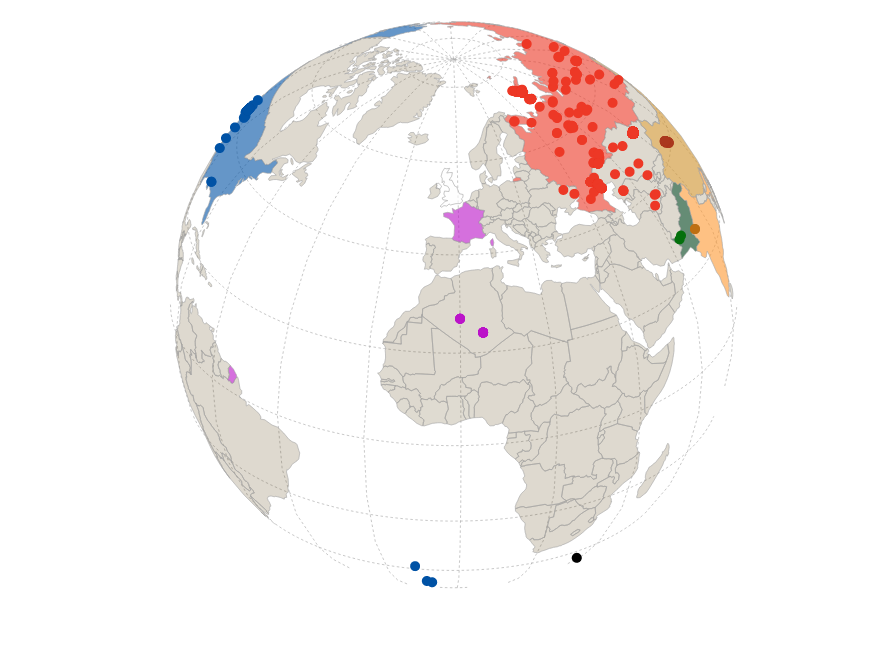

# d3-chart-atlas

## Building from Source

Build `atlas.js`, which defines d3-chart-atlas.

To download the devlopment dependencies:
```
npm install
```
Then type:

```
npm run bundle
npm run minify
```

This compiles the ES6 modules into a self-executing script (`atlas.js`) and then minifies that script (`atlas.min.js`).

## Using

See [d3.chart][d3.chart] to get started using Miso Project's framework for creating reusable charts.

After **d3.chart.js** has been included (in a script tag, for example), d3 selections have a `chart("mychart", options)` method exposed.

You can use `d3.chart` to create a map instance after **atlas.js** has been included after **d3.chart.js** is available. Suppose you had another chart definition file **barchart.js**. Then `chart("FancyBarChart", options)` could be used to create a FancyBarChart as it is defined in 'barchart.js'.

```html
...
<script src="https://cdnjs.cloudflare.com/ajax/libs/d3/3.5.5/d3.min.js"></script>
<script src="http://d3js.org/d3.geo.projection.v0.min.js" charset="utf-8"></script>
...
<script src="https://cdnjs.cloudflare.com/ajax/libs/topojson/1.6.19/topojson.min.js"></script>
<script src="https://cdn.rawgit.com/bmershon/d3-chart-atlas/v1.0/d3.chart.js"></script>
<script src="https://cdn.rawgit.com/bmershon/d3-chart-atlas/v1.0/atlas.js"></script>
<script src="app.js"></script>
```

In your main visualization code, you can instantiate a map instance like this...

```js
var svg = d3.select("#map")
      .append("svg")
      .attr("width", width)
      .attr("height", height);

var options = {};
options.layers = [];

options.layers.push({
  class: function(d, i) {return "country " + d.properties.continent.replace(/\s+/g, '') + " " + d.properties.admin.replace(/\s+/g, '')},
  object: "countries",
  id: function(d, i) {return d.properties.admin.replace(/\s+/g, '');}
});

options.layers.push({
  class: function(d, i) {return "test " + d.properties.country},
  object: "nuclear",
  id: function(d, i) {return "test-" + d.properties.year},
  filter: function(d, i) {return d.properties.year <= 2005}
});

// optional projection, orthographic is the default
var m = svg.chart("atlas", options)
           .graticule(d3.geo.graticule().step([20, 20]))
           .projection(d3.geo.orthographic().clipAngle(90 + 10e-6))
           .pointRadius(4);
```

...and then when you have loaded `data`, a [topojson][topojson] object...

```js
m.draw(data)
 .zoomToLayer("countries");
```
[Click to see the live example][orthographic-example]


## Background

The canonical representation of data in D3.js is the [array][array-manipulation]. D3 allows for the binding of arbitrary data to elements in the DOM, and it's declarative approach to managing sets of bound data and DOM elements, using [d3.selection][d3.selection], provides a flexible engine for building novel data visualizations.

Miso Project has released a neat little library called [d3.chart][d3.chart], which aims to make the creation of reusable charts a more organized process. According to @themisoproject, reusable charts should be:

* repeatable
* configurable
* extensible
* composable

The underlying components that d3.chart seeks to manage are called *layers*. A layer is a natural grouping of elements that are bound to data and constite a component of a chart. A simple bar-chart, for example, may require a layer for the bars, a layer for the axis and axis labels, and another layer for the labels positioned at the tips of the bars. Each of these three layers has ways to handle entering elements, updating elements, and exiting elements. Where d3.js is, at its heart, concerned with the manipulation of arrays, d3.chart sits on top of d3 and concerns itself with drawing the many layers of a chart.

`d3-chart-atlas` aims to help manage the d3 geometry pipeline for maps with one or more layers of geometry. This d3.chart abstracts away the management of enter, update, and exit selections without preventing users from configuring the functions used at any stage of the d3.geo pipeline.

In addition, d3-chart-atlas solves the most common problems users seem to encounter when it comes to scaling maps, zooming, and changing projections.


[array-manipulation]: https://github.com/mbostock/d3/wiki/Arrays

[d3.selection]: https://github.com/mbostock/d3/wiki/Selections

[d3.chart]: http://misoproject.com/d3-chart/

[topojson]: https://github.com/mbostock/topojson/wiki

[orthographic-example]: http://bl.ocks.org/bmershon/ccf463d4cb5ee6a10a3f
